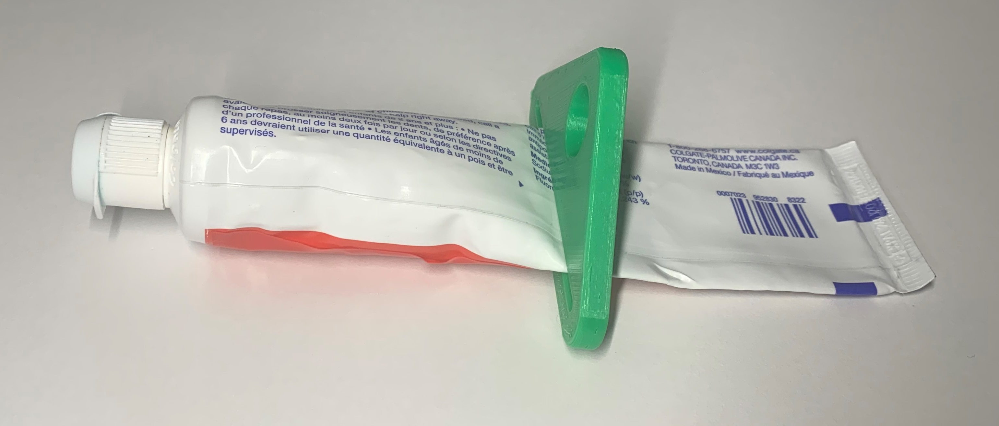

# Toothpaste Squeezer
The Toothpaste Squeezer is an inexpensive 3D-printed device that aids the removal of toothpaste. This device may benefit those with limited hand dexterity or those who find it challenging to get the last bit of toothpaste out of the tube.

This design was created by [Spidersky1489](https://www.printables.com/social/54495-spidersky1489/about) and posted on [Printables.com](https://www.printables.com/model/26897-toothpaste-squeezer/files).

## More info at
- [Makers Making Change Project Page](https://makersmakingchange.com/project/toothpaste-squeezer/)

## How to Obtain a Toothpase Squeezer
### 1. Do it Yourself (DIY) or Do it Together (DIT)

This is an open-source assistive technology, so anyone is free to build it. All of the files and instructions required to build the Toothpase Squeezer are contained within this repository. Refer to the Maker Checklist below.

### 2. Request a build of this device

If you would like to obtain a Toothpase Squeezer , you may submit a build request through the [MMC Library Page](https://makersmakingchange.com/project/toothpaste-squeezer/). The requestor is responsible for the cost of materials and any shipping.

### 3. How to build this device for someone else

If you have the skills and equipment to build this device, and would like to donate your time to create the switch for someone who needs it, visit the [MMC Maker Wanted](https://makersmakingchange.com/maker-wanted/) section.

## Getting Started

### 1. Read the Makers Checklist

The Makers Checklist contains a list of tasks to complete to build the device.

### 2. Print the 3D Printable component

The print files can be in the [/Build_Files/3D_Printing_Files](/Build_Files/3D_Printing/) folder.

## Files
### Documentation
| Document             | Version | Link |
|----------------------|---------|------|
| Design Rationale     | 1.0     | [Toothpaste_Squeezer_Design_Rationale](/Documentation/Toothpaste_Squeezer__Design_Rationale_v1.0.pdf)     |
| Maker Checklist      | 1.0     | [Toothpaste_Squeezer_Maker_Checklist](/Documentation/Toothpaste_Squeezer__Maker_Checklist_v1.0.pdf)     |
| Bill of Materials    | 1.0     | [Toothpaste_Squeezer_Bill_of_Materials](/Documentation/Toothpaste_Squeezer__BOM_v1.0.xlsx)     |
| 3D Printing Guide    | 1.0     | [Toothpaste_Squeezer_3D_Printing_Guide](/Documentation/Toothpaste_Squeezer__3D_Printing_Guide_v1.0.pdf)     |
| Assembly Guide       | n/a     | No Assembly Required.     |
| User Guide           | 1.0     | [Toothpaste_Squeezer_User_Guide](/Documentation/Toothpaste_Squeezer__User_Guide_v1.0.pdf)    |
| Changelog            | 1.0     | [Toothpaste_Squeezer_Changelog](/Documentation/Toothpaste_Squeezer__Changelog_v1.0.pdf)     |

### Design Files
Not available.

### Build Files
 - [3D Printing Files](/Build_Files/3D_Printing)

## Attribution
Design: [Spidersky1489](https://www.printables.com/social/54495-spidersky1489/about)

Documentation by Neil Squire / Makers Making Change.

## License
The design of the [Toothpaste Squeezer](https://www.printables.com/model/26897-toothpaste-squeezer) by Spidersky1489 is licensed under [Creative Commons (International License) Public Domain](http://creativecommons.org/publicdomain/zero/1.0/).

Accompanying material such as instruction manuals, videos, and other copyrightable works that are useful but not necessary to design, make, test, or prepare the Toothpase Squeezer are published under a Creative Commons Attribution-ShareAlike 4.0 license https://creativecommons.org/licenses/by-sa/4.0/ (CC BY-SA 4.0).

---
<!-- ABOUT MMC START -->
## About Makers Making Change

Makers Making Change is a program of [Neil Squire](https://www.neilsquire.ca/), a Canadian non-profit that uses technology, knowledge, and passion to empower people with disabilities.

Makers Making Change leverages the capacity of community based Makers, Disability Professionals and Volunteers to develop and deliver affordable Open Source Assistive Technologies.

 - Website: [www.MakersMakingChange.com](https://www.makersmakingchange.com/)
 - GitHub: [makersmakingchange](https://github.com/makersmakingchange)
 - Bluesky: [@makersmakingchange.bsky.social](https://bsky.app/profile/makersmakingchange.bsky.social)
 - Instagram: [@makersmakingchange](https://www.instagram.com/makersmakingchange)
 - Facebook: [makersmakechange](https://www.facebook.com/makersmakechange)
 - LinkedIn: [Neil Squire Society](https://www.linkedin.com/company/neil-squire-society/)
 - Thingiverse: [makersmakingchange](https://www.thingiverse.com/makersmakingchange/about)
 - Printables: [MakersMakingChange](https://www.printables.com/@MakersMakingChange)

### Contact Us
For technical questions, to get involved, or to share your experience we encourage you to [visit our website](https://www.makersmakingchange.com/) or [contact us](https://www.makersmakingchange.com/s/contact).
<!-- ABOUT MMC END -->
